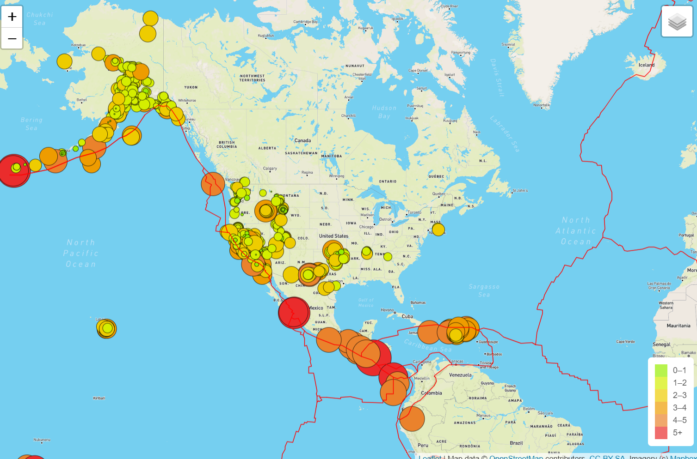
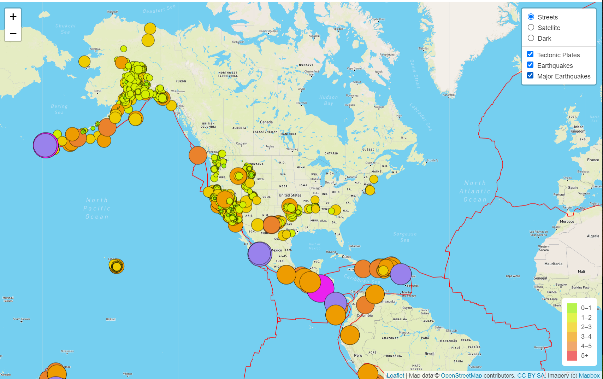
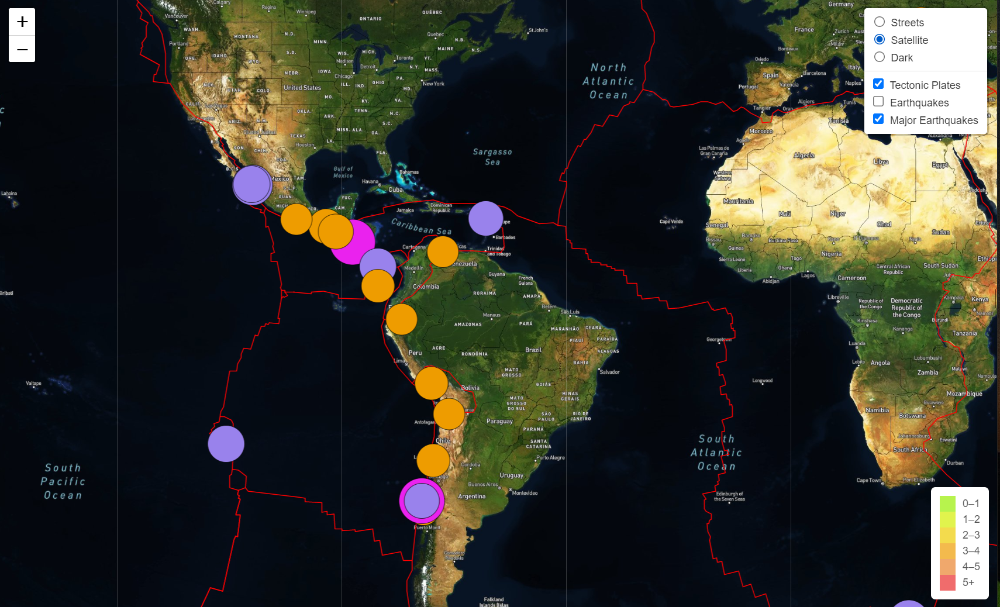
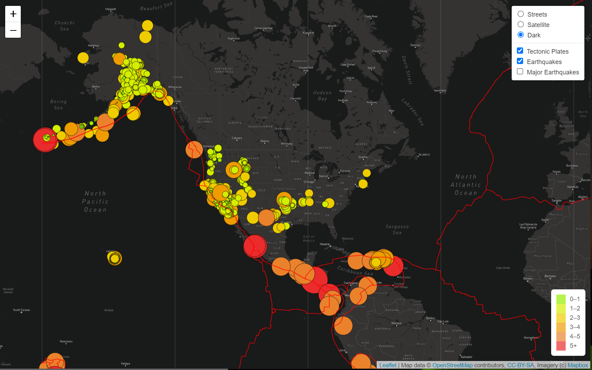

# Mapping Earthquakes

### **Objectives**

The objective of this project is to make an insightful data visualization by building a website that presents information about earthquakes around the world. The project requires us to build interactive features in a website that can be used by desktops as well mobile phones. We gathered the latest earthquake _GeoJSON data_ from the US Geological Survey website. We used _JavaScript_, _D3_ and _Leaflet_ libraries to retrieve the data and plotted a layered data on _mapbox map_ through an API request. _GeoJSON_ data is a type of JavaScript Object Notation (_JSON_) data specifically designed to host geographical information. We showed the location of the earthquake by a circle marker whose diameter is proportional to the magnitude of the earthquake. A popup box shows the magnitude and the location of the earthquake when a circle marker is clicked. A large magnitude earthquake is shown with a larger and darker color (red) circle, while a low magnitude earthquake is smaller and in lighter color (yellow). We added a legend in the lower right side of the map that shows the color key of the earthquake magnitudes. The map contained the tectonic plate boundaries (fault lines) and the view can be toggled between a streetview, a satellite view as well as a dark view. 

### **Analysis and Summary**

We used **_Leaflet JavaScript library_** to set up the *index.html* and *challenge_logic.js* files for this project. The JavaScript and the HTML files communicate with each other to form the dynamic webpage with layers using the data from a remote site. We also included a css style sheet, *style.css*. We did an _API_ call to *mapbox.com* for our base layer (static tile) of map. We used _Leaflet map_ to plot the map in html. Mapbox has different style of maps. We used the streets (_streets-v11_), satellite (_satellite-streets-v11_) and dark (_dark-v10_) views that can be toggled. We centered the map using the latitude and longitude and adjusted the zoom level based on our focus of study. For example, we used latitude and longitude [33.9, -118.4] for LAX airport in Los Angeles, California. The zoom level of the map can be adjusted. We used a zoom level 3 for showing continents and 18 for street level views. We learned to add markers, popup markers, circle markers, draw lines, LineStrings and polygons as layers on the map. We retrieved the earthquake GeoJSON data from <a href="https://earthquake.usgs.gov/earthquakes/feed/v1.0/summary/all_month.geojson"> _US Geological Survey_ website. </a> 

 We also learned to create branches in GitHub, push files and merge files with the _main_  branch. The summary of the three deliverables for the project is given below. 

 ### Deliverable 1: Add Tectonic Plate Data

 We added the tectonic plate data retrieved from a <a href="https://raw.githubusercontent.com/fraxen/tectonicplates/master/GeoJSON/PB2002_boundaries.json"> GITHUB repository,  *GeoJSON/PB2002_boundaries.json*</a> as an overlay on the base map. The styles lines of the tectonic plates are drawn in red to stand out. The weight of the lines is 1. An image of the web page is shown in Fig.1 below. 

 

 **Fig 1:** The image shows the tectonic plate fault lines and earthquake locations. The smaller yellow color circles represent small magnitude earthquake, while the larger red color circles are earth quake of magnitude larger than 5. 

 ### Deliverable 2: Add Major Earthquake Data

 We made a layer on of major earthquake with the data retrieved from <a href="https://earthquake.usgs.gov/earthquakes/feed/v1.0/summary/4.5_week.geojson">GeoJSON Summary Feedfor M4.5+ Earthquakes</a> of magnitude greater than 4.5 for past 7 days on top of the previous layers of the map. I colored these major earthquake circles a different color so that it would stand out when filtered by the major earthquake. I wanted this deliverable work to stand out. An earthquake with a magnitude greater than 6  is colored magenta (*#ea22ee*), greater than 5 is colored purple (*#9982ec*) and less than 5 is colored orange (*#ee9c00*). Figure 2 shows an image of all the earthquake and Fig 3 shows an image of the map filtered with only the major earthquake. The datasets can be toggled off or on.

 

 **Fig 2:** The image shows the "Streets view" of a map of all the earthquakes. The magenta and purple color circles are the overlay of the major earth quake that can be filtered out by the toggle box shown in the upper right corner.

 

 **Fig 3:** The image shows a satellite view of the major earthquakes only. 

 ### Deliverable 3: Add an Additional Map

 A third map style is added for this deliverable. I added a *Dark* layer from Mapbox styles (dark-v10) of map that can be toggled on or off with the Street or Satellite views. The image is shown in Fig 4 below. 

 

 **Fig 4:** The figure shows the image of a dark map of earthquakes. 
